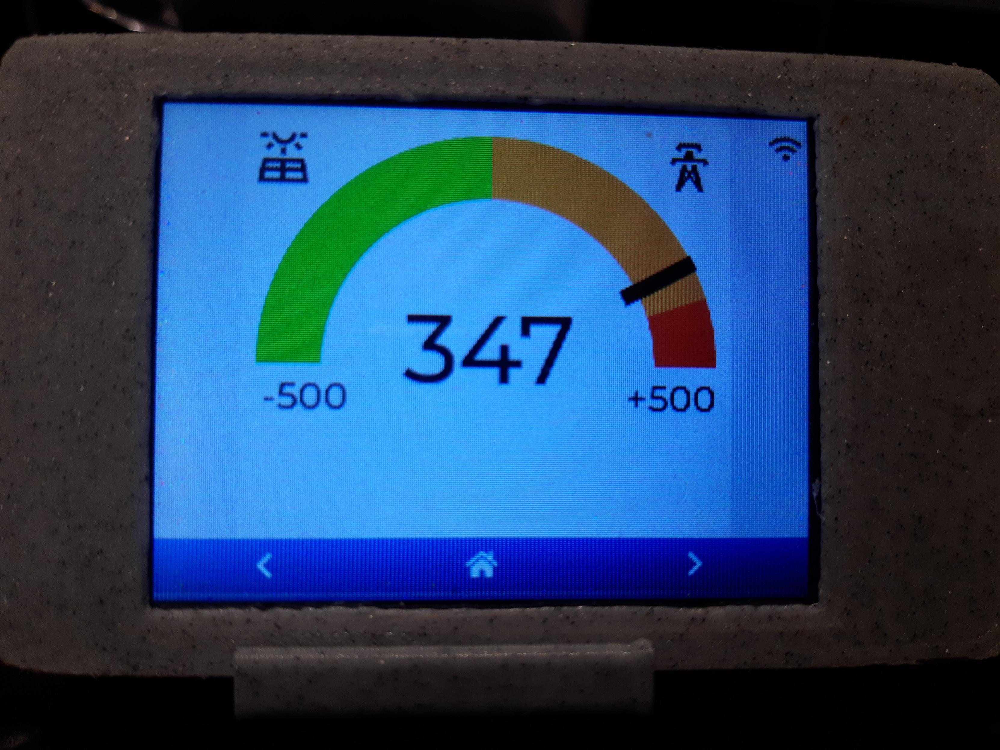

# Smart Meter Energy Display

Adaptation of example esphome with LVGL to display energy consumption collected by linky homeassistant (grid + solar). 



Run : 

```
esphome run  yellowtft1.yaml
```

To interate faster on dev environment use SDL : 

```
esphome run sdl.yaml
```


### TODO 

* [ ] merge code so that only one file is imported by both yellowtft1.yaml and sdl.yaml
